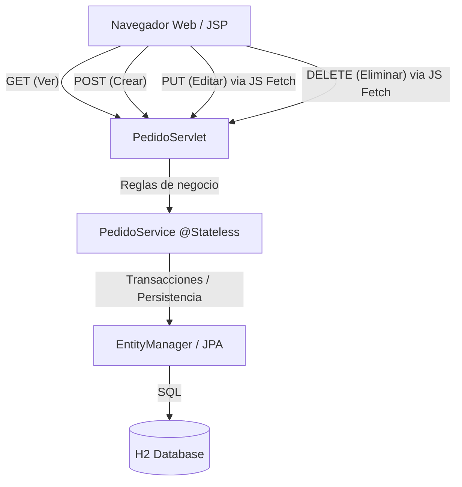

# Sistema de Pedidos - Versión Avanzada con PUT y DELETE reales

Este proyecto es una extensión del Sistema de Pedidos base (Servlet + JSP + Maven + JPA + H2). Cumple con el **RETO AVANZADO** y permite alcanzar la nota máxima (20/20) al implementar la actualización y eliminación utilizando los verbos HTTP `PUT` y `DELETE` desde el navegador mediante JavaScript `fetch()`.

## Requisitos
- JDK 21
- Maven 3.9+
- Puerto 8081 disponible

## Ejecución
1. Abre una terminal en la raíz del proyecto.
2. Ejecuta el comando:
   ```bash
   mvn clean wildfly:run
   ```
3. Abre el navegador en: [http://localhost:8081/sistema-pedidos/](http://localhost:8081/sistema-pedidos/)
4. Para detener la aplicación, presiona `Ctrl + C` en la terminal.

## Arquitectura y Diagrama
Se mantiene la separación de responsabilidades y la arquitectura en capas:



### Flujo Técnico de una Operación (ej. PUT - Actualización)
1. **Navegador:** El usuario presiona "Actualizar" en el formulario de edición. JavaScript captura los datos y usa `fetch('pedidos', { method: 'PUT', body: ... })` para enviar la información al servidor de forma asíncrona.
2. **Web Tier (PedidoServlet):** El método `doPut()` intercepta la solicitud HTTP, parsea el `InputStream` para recuperar los parámetros `id`, `cliente`, `productoId` y `cantidad`, y delega la operación a `pedidoService.actualizarPedido(...)`.
3. **Business Tier (PedidoService):** Al ser un `@Stateless`, abre automáticamente una transacción. Aplica las validaciones (verificando que la cantidad sea válida, comprobando los stocks cruzados entre el producto viejo y el nuevo si hubo cambio). Si algo falla, lanza un `PedidoException` que automáticamente hace _rollback_ de la transacción, evitando que los datos queden en estados inconsistentes.
4. **Persistencia (JPA/H2):** Recupera los objetos, actualiza el estado (ej. `producto.reducirStock(diff)`). El contenedor sincroniza el estado modificado al final de la transacción de forma transparente.
5. **Respuesta:** El Servlet devuelve el código HTTP adecuado (200 OK si tuvo éxito, 400 Bad Request si el stock falló, o 500 Internal Error).
6. **Actualización Interfaz:** Si el resultado fue exitoso, el frontend en JavaScript recibe `res.ok`, recarga la página para mostrar los datos más recientes (PRG vía cliente).

## Estrategia Empleada para el Reto (20 puntos)
A diferencia de la solución base con `<input type="hidden" name="action">` mediante POST, este proyecto integra JavaScript puro (`fetch()`) en la JSP para consumir el backend de manera REST-like, enviando peticiones HTTP formales:
- `PUT`: Para actualizar, enviando un `application/x-www-form-urlencoded` mapeado por `doPut()` del Servlet.
- `DELETE`: Pasando el ID en la query string (`/pedidos?id=X`) y resolviéndolo en el `doDelete()` del Servlet.

Se implementó el patrón de compensación de stock directamente en las Entidades de Dominio (`Producto#reducirStock`, `Producto#aumentarStock`) asegurando encapsulamiento.

## Casos Prácticos Implementados
1. **CASO 1 - Editar solo el cliente:** En `PedidoService`, se evalúa que el `productoId` y la `cantidad` permanecen iguales, así que únicamente se reasigna el cliente. El producto no pierde ni gana stock.
2. **CASO 2 - Editar cantidad manteniendo producto:** Se calcula la diferencia `diff = nuevaCantidad - antiguaCantidad`. Si el cliente aumenta de 5 a 8, la diferencia es `+3` y se verifica si el stock cubre esos 3 adicionales antes de restarlo. Si se reduce a 2, la diferencia `-3` devuelve 3 unidades al stock original.
3. **CASO 3 - Cambiar el producto del pedido:** Ocurre una operación compuesta y atómica: el sistema busca el producto "viejo", le aumenta/repone las unidades reservadas; luego busca el producto "nuevo" y reduce la cantidad total de su stock actual.
4. **CASO 4 - Rechazar edición inválida:** Si se solicita más cantidad del stock disponible en cualquier momento (nuevo registro, o actualización al aumentar la cantidad requerida), la clase `Producto` lanza `PedidoException`. El contenedor JTA marca la transacción para _rollback_ y la base de datos queda idéntica, devolviendo en el Servlet el mensaje real (`HTTP 400 Bad Request`) mostrando una alerta en UI (roja) sin modificar tablas.
5. **CASO 5 - Eliminar pedido y reponer stock:** Previo al método `em.remove(pedido)`, la lógica de negocio recupera el producto asociado y llama a `producto.aumentarStock(pedido.getCantidad())`. De inmediato el pedido se descarta.

### Verificación del Reto Avanzado
Para comprobar que se están utilizando los verbos HTTP `PUT` y `DELETE`, abra las herramientas de desarrollador en su navegador (F12) > pestaña **Network (Red)** y observe las llamadas "pedidos" generadas al editar y eliminar. En la columna _Method_ visualizará explícitamente **PUT** y **DELETE**.

---
**Nota para el informe:** Recuerda incluir capturas de la herramienta *Network/Red* del navegador evidenciando estas llamadas HTTP, además de las pantallas de la interfaz para cada caso práctico antes y después del cambio.
